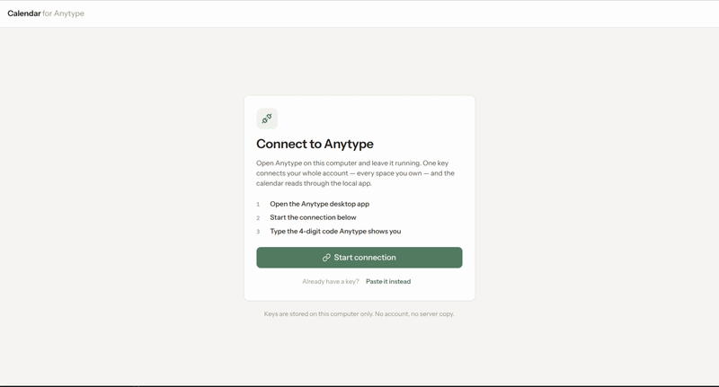

# Calendar for Anytype



A desktop calendar for [Anytype](https://anytype.io). It reads objects from your local
Anytype account through the local API and lays the ones carrying date properties onto a
month, week or day view — so a `Task` with a due date, a `Meeting` with a start and end, and
a `Note` with a creation date all show up in one place, without leaving your data or moving
it anywhere.

You pick which spaces, object types and queries (Anytype "sets") to track, and which date
property of each type anchors it on the grid (a type with both a start and an end property
is drawn as a range). Objects take their type's Anytype colour, or the colour of the option
picked in a select property of your choice.

> **Status: beta (`1.0.0-beta.2`).** Every screen runs against your real Anytype data — no
> mock data anywhere.
>
> - **Sign-in** through Anytype's 4-digit challenge/code flow, or by pasting a key you
>   already hold. The key is kept, encrypted, across restarts. Where Anytype serves the
>   (pre-release) API v2 the app uses it — you then choose in Anytype which spaces the key
>   reaches and whether it may write — and falls back to v1 where not. Settings shows the
>   API major in use and what the key was granted, and onboarding and Settings say when the
>   key leaves some of your spaces out.
> - **Schema**: the app reads each space's dated types (and, under v2, its queries over a
>   single dated type, its image, and its select properties' option colours). Onboarding
>   and Settings save which spaces, types and queries go on the calendar, each one's From/To
>   date property, whether those dates carry a time of day, which select property colours
>   its objects, and which view a query reads through.
> - **Calendar**: month, week and day views. A range is one continuous bar across the days
>   it spans, timed objects are placed by the hour in the week and day views, and the detail
>   panel shows an object's Done and Location (v2) and opens it in Anytype. An object that
>   both a type and a query bring is drawn once. What is on screen is read again when you
>   come back to the window.
> - **Editing** (v2, with a read/write key): drag an object to move it, double-click a day
>   or an hour to create one, and tick it done from its panel.
> - **Preferences**: light/dark theme, the view to open on, first day of the week, ISO week
>   numbers, 12/24-hour time, and the language — English, Spanish or Galician, following
>   the OS by default.
> - **Releases**: installers for Linux, Windows and macOS are built by a GitHub Actions
>   workflow. Windows builds update themselves; macOS and Linux builds say when a newer
>   release is out. Settings → About shows the running version.
>
> Recurrence is not built yet. The backend is organised as one package per bounded
> context — `auth`, `schema` and `events` — plus two shared packages, `anytype-v1` (what the
> app still reads through v1) and `kernel` (shared use-case plumbing). Anytype is reached
> through [`@ablunier/anytype-client`](https://github.com/ablunier/anytype-client), a typed
> client for the local API v2 that is published on npm as its own project.

## Requirements

- Node.js ≥ 26.8.1 and npm ≥ 12.0.2 (both pinned via [Volta](https://volta.sh) in
  `package.json`; Volta will pick them up automatically if installed)
- Anytype desktop, running, to sign in (or use the simulated one, below)

## Getting started

```sh
npm install
env -u ELECTRON_RUN_AS_NODE npm run dev
```

`npm install` also fetches the Electron binary and installs the isolated architecture-lint
toolchain, via the root `postinstall`.

**The `env -u ELECTRON_RUN_AS_NODE` prefix matters.** If that variable is set in your shell
(some editors and terminal integrations set it), Electron starts in plain Node mode and
`npm run dev` dies with a misleading `TypeError` about `isPackaged`.

The app opens on the auth screen. Start the connection and Anytype shows a 4-digit code;
type it into the app. If you already hold an API key (from a previous session, or minted
directly in Anytype under Settings → API Keys), you can paste it instead of running the
code flow. The key is then stored in the app's user-data directory
(`~/.config/anytype-calendar-desktop/credential.bin` in dev on Linux), encrypted with the
OS keychain through Electron's `safeStorage`. Once connected, the app reads your spaces'
dated types (and queries, under API v2) and walks you through onboarding — which spaces,
types and queries to track, and each type's From/To date property — or reopens straight
past it if you'd already done that on a previous run. The calendar then shows the objects
of what you picked, in the view chosen in Settings (the month by default): a type with a To
date is drawn as one continuous bar across the days it spans, and clicking into a day opens
the event detail panel, which can open the object directly in Anytype. The week and day
views lay timed objects out by the hour, with a band above the grid for dates that carry no
time and for ranges crossing midnight. Dates without a time are drawn as all-day, and times
are shown in your computer's time zone. If the key may write, objects can be dragged to
another day or hour, created by double-clicking, and ticked done from their panel. The
calendar's top bar also has a light/dark theme toggle, remembered across restarts. Signing
out deletes the credential file. The local API cannot revoke a key, so to revoke one,
delete it in the Anytype app under Settings → API Keys.

Against an Anytype that serves API v2, `ANYTYPE_CALENDAR_API=v1` forces the v1 fallback
(and `v2` forbids it). Use it only with a legacy key: v1 refuses a key paired through v2,
and a refused key is signed out, which deletes it.

To work without Anytype, sign in against a simulated one:

```sh
env -u ELECTRON_RUN_AS_NODE ANYTYPE_CALENDAR_FAKE_AUTH=1 npm run dev
```

The terminal then logs each challenge and the code to type — always `2749` (or paste the
API key `ak_fake_2749` directly). The simulated key is kept in a separate
`credential-fake.bin`, the schema comes from four sample spaces
`InMemorySchemaGateway` builds, and the objects from a sample month `InMemoryEventsGateway`
seeds around the current one — never anything from a real Anytype instance. Edits made
there are kept in memory for the session.

## Scripts

Run from the repo root.

| Command                    | What it does                                                                                                                                      |
| -------------------------- | ------------------------------------------------------------------------------------------------------------------------------------------------- |
| `npm run dev`              | electron-vite dev server + Electron, with HMR (see the env note above)                                                                            |
| `npm run build`            | `tsc -b` across all packages, then build the desktop app                                                                                          |
| `npm run typecheck`        | `tsc -b --force` over the whole monorepo                                                                                                          |
| `npm test`                 | `vitest run`: one project per layer (`domain`, `application`, `infrastructure`) across all contexts, plus the desktop app's `renderer` and `main` |
| `npm run lint:arch`        | dependency-cruiser check of the hexagonal layering                                                                                                |
| `npm run lint:arch:setup`  | install the arch-lint toolchain (only if `postinstall` was skipped)                                                                               |
| `npm run clean`            | `tsc -b --clean` plus the desktop app's `out/` and `dist/`                                                                                        |
| `npm run package` / `make` | package, or build installers for, the desktop app for this OS with Electron Forge, into `apps/desktop/dist`                                       |

A single test file: `npx vitest run packages/<context>/<layer>/path/to/file.test.ts`; one
layer across every context: `npx vitest run --project domain`.

## Releasing

Bump `version` in `apps/desktop/package.json`, commit, then tag and push:

```sh
git tag v1.2.3 && git push origin v1.2.3
```

The `Release` workflow checks the tag matches that version, builds the Linux (`.deb`),
Windows (Squirrel `Setup.exe`) and macOS (`.dmg`, `.zip`) installers on their own
runners, uploads them to a draft GitHub release and publishes it once all three are in. To
build the installers without releasing, run the workflow by hand from the Actions tab; they
are kept as workflow artifacts.

The builds are not code-signed. Windows SmartScreen warns on first run ("More info" → "Run
anyway"). macOS refuses to open the app at first: try once, then allow it under System
Settings → Privacy & Security → "Open Anyway".

Installed Windows builds update themselves: every 10 minutes the app asks
[update.electronjs.org](https://update.electronjs.org) for a newer published release of this
repository (which must stay public) and offers to restart into it. macOS only applies updates
to a code-signed app, and Linux's `.deb` has no updater, so there the app checks GitHub for a
newer release at launch and every 6 hours, says so in the calendar's top bar and in
Settings → About, and links to the release page to download it by hand.

## Repo layout

```
apps/desktop             Electron app — main (the composition root), preload, and the React renderer
packages/<context>       One bounded context per package (currently: auth, schema, events), layered inside
packages/anytype-v1      The v1 routes the app still reads, and the probe that picks v1 or v2 per key
packages/kernel          Shared use-case plumbing (DispatchGuard) any context's application layer can import
tools/arch-lint          Isolated dependency-cruiser install (see its README for why)
docs/deps-notes.md       Why several dependencies are pinned where they are
```

### Architecture

Organised by bounded context first, then by hexagonal layer, then by role:

```
packages/auth/     signing in, and keeping the key
packages/schema/   the account's dated types and queries, and which of them go on the calendar
packages/events/   the objects of those in the month, week or day on screen, and edits to them
  domain/           model/, gateways/, repositories/  — the pure center
  application/      use cases, orchestrating the domain through its ports
  infrastructure/   driven adapters implementing those ports, by technology (in-memory/, anytype/, encrypted-file/, local-time/)
```

Each layer is imported from outside as `@anytype-calendar/<context>/<layer>`. Dependencies
point inward only, within a context:

```
domain          -> nothing
application     -> its own domain, plus kernel
infrastructure  -> its own domain, plus @ablunier/anytype-client and anytype-v1
apps/desktop    -> any context's layers, plus Electron and React
```

A context's domain has no npm dependencies and no Node core imports, and the whole context
compiles with no ambient types (`types: []`), so platform globals like `process` or
`setTimeout` are out of reach too — infrastructure receives such capabilities from the
composition root instead. Adapters are reached through ports the domain declares, never
imported directly by the use cases. `packages/anytype-v1` and `packages/kernel` are the two
shared packages — not contexts, each with only one layer, so the same aliasing, test
projects and lint rules apply to them unedited. `anytype-v1` has only an `infrastructure/`
layer and imports only the Anytype client; `kernel` has only an
`application/` layer (the `DispatchGuard` dispatch/staleness-guard pattern used by use cases
that race an async gateway call against a later reset) and, uniquely, imports nothing at
all — not even Node core or npm — so it stays safely importable from any context's
application layer without adding a dependency edge of its own. Contexts never import each
other; `apps/desktop`'s main process wires them together. No package imports from
`apps/**`, and `electron`/`react` belong solely to `apps/desktop`.

Each context's `infrastructure/anytype/` holds a v1 gateway, a v2 gateway and one that picks
between them per call, through the probe in `anytype-v1` that asks Anytype which major of
the API it serves. Both talk to Anytype through `@ablunier/anytype-client`'s methods rather
than building requests themselves; a route the client lacks is added there and released,
not patched here. Dropping v1 later means deleting `anytype-v1` and one gateway per context.

All of that is enforced by `.dependency-cruiser.cjs` via `npm run lint:arch`, which reads
the rules alongside the reasoning for each one. Run it before opening a PR that adds
imports across package boundaries.

The workspace packages are consumed **from source** rather than from their built `dist/`,
through one pattern alias in `apps/desktop/electron.vite.config.ts` and the root `vitest.config.ts` —
so `npm run dev` and `npm test` never need a prior build, and editing a package hot-reloads
in the running app.

### The renderer

`apps/desktop/src/renderer/src` holds the React app: `App.tsx` is the root,
`screens/<flow>/` has one directory per screen (`auth`, `onboarding`, `config`,
`calendar` — the last drawing the month grid and the week/day hour grid),
`components/ui/` the presentational primitives, and `lib/` the pure modules that turn the
snapshots main pushes into what the screens draw (`lib/session.ts`, `lib/schema.ts`,
`lib/events.ts`). Nothing is mocked: every screen runs against the `auth`, `schema` and
`events` contexts' adapters over IPC. Navigation is local `useState`, not a router — four
fixed screens, no URLs — but the span on screen (a month, week or day) is held in main, and
the arrows, Today and the view switcher only ask for another. Translations live under
`i18n/locales/` (`react-i18next`).

Imports that leave their own directory go through the `@renderer/*` alias
(`@renderer/components/ui`), and same-directory imports stay relative (`./EventChip`) — so
a module's own neighbourhood reads as local and everything else is absolute, with no `../../`
chains to recount when a file moves. The alias is declared in three places that must agree:
`resolve.alias` in `electron.vite.config.ts` (the bundler), `paths` in `tsconfig.web.json`
(the typechecker), and `paths` in the root `tsconfig.paths.json` (dependency-cruiser).
`@shared/*` works the same way for `src/shared/ipc.ts`, the IPC contract between main,
preload and renderer.

## Roadmap

Not built yet, roughly grouped:

### Config

- Configurable mapping of which Anytype properties show in the event detail panel

### Calendar

- Year view
- Per-space toggle for whether its events show on the calendar

### General

- Keyboard shortcuts / command palette
- System notifications for upcoming events
- Auto-update in all platforms
- Anytwo compatibility

## Notes for contributors

- `docs/deps-notes.md` explains the version pins (`electron` exact, `vite@^7`,
  `@vitejs/plugin-react@^5.2.0`) and the `postinstall` steps. Read it before bumping any of
  those — several are load-bearing in non-obvious ways.
- `tools/arch-lint/README.md` explains why the lint toolchain lives outside the npm
  workspace, and how to remove it once dependency-cruiser supports TypeScript 7.
- Several files carry doc comments explaining _why_ a structural choice was made
  (`App.tsx`, `lib/session.ts`, `types/index.ts`, `.dependency-cruiser.cjs`) — worth reading
  before changing their behavior.
- `AGENTS.md` is the guidance file for AI coding agents working in this repo.
